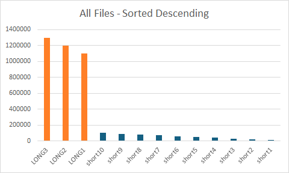
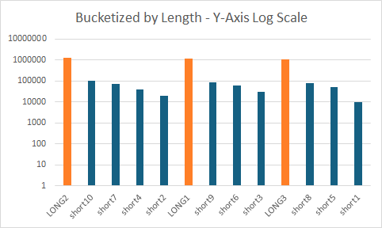
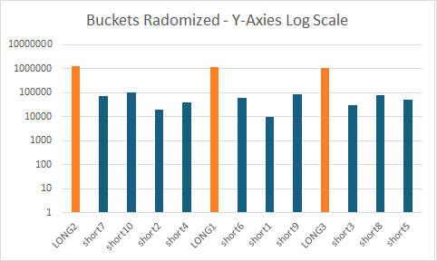

# Windows Media Playlist Tool
(_Most of this is based on/copied from playlisttool.py and mediafileclass.py files_)

This tool reads a Windows Media Player Playlist XML file and distributes
the media files into 'buckets' defined by the media files that are greater
than some threshold in length, and the 'buckets' contain the shorter files.

```
usage: playlisttool.py [-h] [-b BUCKET_THRESHOLD] [-c] [-d] [-o OUTPUT_FILENAME] -p PLAYLIST_FILE [-r] [-t PLAYLIST_TITLE] [-v] [-w WPL_FILE]

Playlist Tool

options:
  -h, --help            show this help message and exit
  -b BUCKET_THRESHOLD, --bucket-threshold BUCKET_THRESHOLD
                        Bucket threshold (in ms). Smaller number here will produce more buckets, larger value will produce fewer buckets.
  -c, --csv             When this switch is present, output is csv.
  -d, --distribute-files
                        When this switch is present, a new list is created with the songs distributed according to length.
  -o OUTPUT_FILENAME, --output-file OUTPUT_FILENAME
                        Name of file for output. This is execution output, not the the name of the new playlist file. Use -w/--wpl-file param to specify the new WPL file name.
  -p PLAYLIST_FILE, --playlist-file PLAYLIST_FILE
                        Name of playlist file to process.
  -r, --remove-bad-files
                        Remove any bad files found (really just ignores them) Does not remove from storage.
  -t PLAYLIST_TITLE, --title PLAYLIST_TITLE
                        Specify the title for the new playlist (if -w is specified)
  -v, --verbose         Enable for verbose output
  -w WPL_FILE, --wpl-file WPL_FILE
                        Name of new wpl file to create.
```


Kind of silly, given the age of WMP and the goal, but here's the "**Why?**"...

I have a playlist that I created for just about all my media files (nearly
1500 files)

About 200 of the media files are 45min or longer, while most of the remaining
files are ones dumped from my library of CDs, and are much shorter.

Just randomly sorting the entire list, often places the longer files near or
next to the other long ones.

I'd rather have the longer ones spread out semi-evenly, and
then all the shorter files be sprinkled evenly throughout the entire list.

By treating these 'longer' files as bucket delimiters, all the files that are
shorter in length, are placed within these buckets, and the way the algorithm
does this, each bucket has a relatively even length of play time [Not exactly
true, see the "Interesting side-effect" comment below]

**Example:**<br>
Given 3 files that are 1hr in length (LONG1, LONG2, LONG3)
And 10 files are shorter, maybe 3-5min (short1, short2, ..., short10)

Below are pictures and tables to try and help explain the processing...

All files sorted by length, descending:
<br>
Figure A<br>
_Long files colored Orange to illustrate_
|Name|Length|
|-|-|
|LONG3|1300000|
|LONG2|1200000|
|LONG1|1100000|
|short10|100000|
|short9|90000|
|short8|80000|
|short7|70000|
|short6|60000|
|short5|50000|
|short4|40000|
|short3|30000|
|short2|20000|
|short1|10000|

Next, the buckets are created (LONG files are randomized), and each bucket is filled in with files below bucket threshold

<br>
Figure B<br>
_(Shown with the Y-axis as logrithmic scale, to make it easier to visualize._)
|Name|Length|
|-|-|
|LONG2|1300000|
|short10|100000|
|short7|70000|
|short4|40000|
|short2|20000|
|LONG1|1200000|
|short9|90000|
|short6|60000|
|short3|30000|
|LONG3|1100000|
|short8|80000|
|short5|50000|
|short1|10000|

And finally, the files with in each bucket are randomized amongst themselves.
<br>
Figure C<br>
_(Shown with the Y-axis as logrithmic scale, to make it easier to visualize._)
|Name|Length|
|-|-|
|LONG2|1300000|
|short7|70000|
|short10|100000|
|short2|20000|
|short4|40000|
|LONG1|1200000|
|short6|60000|
|short1|10000|
|short9|90000|
|LONG3|1100000|
|short3|30000|
|short8|80000|
|short5|50000|

  **Interesting side-effect** of sorting the initial full list in descending order
  of file length, is that the total play time for each bucket steadly decreases.

  This is likely due to the nature of the bucket filling routine, which adds 1
  short file per bucket, starting first bucket and when reaching the last
  bucket, starts (wraps around to) the first bucket again.
  
  This biases the longer overall bucket playtime in descending bucket order,
  because Bucket[N] is always getting File[X] which is >= the length of
  File[X+1], and Bucket[N+1] ends up with with File[X+1] which because of the
  sorting of the list by descending length time means File[X].length >= 
  File[X+1].length, and this causes the overall bucket play time to decrease
  from first bucket, to last bucket.

  If it really needs to be fixed, a couple tweaks to the bucket filling 
  algorithm could produce a better distribution:

  **Algo tweak Option 1:**<br>
  Instead of 'wrapping around' to the first bucket, flip the bucket fill
  direction each time the last/first bucket is found (basically bouncing back
  and forth, until all short files are added)

  **Algo tweak Option 2:**<br>
  Create an array of bucket indices, randomize, fill buckets in this random 
  order, after one iteration, radomize again, and continue until all files
  are distributed.  This might actually remove the need for the
  randomize_buckets() routine all together because the 'randomization' factor is part of the indeces already.

  I doubt I'll ever change it :o)

Key details of the algorithm:
- File is read and a MediaFileClass obj is created for each entry in playlist
- Size and Length are retrived by using win32com.client / Shell.Application
- This complete list is sorted by length (descending) [FIG A in Readme.md]
- A new list is created from all media files that are greater than a given
  threshold
- The rest of the big list of media files is processed, and inserted into each
  bucket one at a time successively, in a descending (length) order. [Fig B in
  Readme.md]
- Then a randomization of the files within each 'bucket' is done [Fig C in
  Readme.md]
- Finally, this new list is written out to a specified XML file.

This all might be a bit goofy, especially the algo I settled on, but this was
part coding exercise and part utilitarian, and in the end I ended up with a
playlist ordered in the way I want. It works, and after listening to the new
playlist, it accomplished what I wanted.

**Execution Notes:**<br>
May need to install lxml and beautifulsoup

`pip install beautifulsoup4 lxml`

**Example usage:** <br>

`python playlisttool.py -p "test.wpl" -d -c -o out.csv -v -w new.wpl`

This will consume playlist file `test.wpl`, distribute the files, and
output the results to the given `out.csv`, generating a new playlist file `new.wpl`, all with verbose output.


**Reference:**<br>
    https://en.wikipedia.org/wiki/Windows_Media_Player_Playlist
