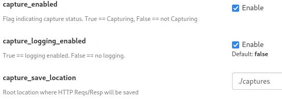

# [MITMProxy Capture HTTP Traffic Add-on](https://github.com/MrJimmo/ToolsAndUtilities/tree/main/WebTraffic/MITMProxyCaptureTraffic)

This is a [MITMProxy](https://mitmproxy.org/) addon that saves requests and responses to local storage.

It's my first go at creating an MITMProxy add-on and likely to evolve as requirements change (ex. Save files in a 'replayable' format).

MITMProxy reference: [https://docs.mitmproxy.org/stable/addons-overview/](https://docs.mitmproxy.org/stable/addons-overview/)

## Key features: ##
- Saves all content from a given browser based on the User-Agent string[*]
- If present, it uses a unique ID provided by the User-Agent string in the http request to name the directory where traffic will be stored.  See the getGetUserAgentID() method for more info.This 'feature' allows capturing and grouping traffic for a given browser.
- Headers are included in the output, one per line as a NAME:VALUE pair.

[*] The "per-user-agent" grouping feature is to support a larger project, where we want content to be saved for a given browsing session.  A unique id will be injected into the User Agent string for each client.  This will enable content processing for a given browser and session.

## Command line options consumed by this addon: ##
|Parameter|Meaning|
|-|-|
|capture_enabled|Allows specifying True == Capture, False == No capture|
|capture_save_location|Allows specifying a new root of save location.|
|capture_logging_enabled:|Allows specifying True == Logging, False == No logging (I added a ton of logging because this is my first MITMProxy addon.)|

These options appear in the MITMProxy or MITMWeb options list.



## Examples: ##
```
mitmweb -s Capture-HTTP-Traffic.py
```
This will start MITMWeb with capturing enabled and files being saved in the default location of `./captures`, which is relative to the location of the script.


```
mitmweb -s Capture-HTTP-Traffic.py
    --set capture_save_location="./NotDefaultCaptureLocation"
    --set capture_enabled=false
    --set capture_logging_enabled=true
```

This will start MITMWeb with this add-on _NOT_ initially capturing/saving HTTP request/responses but logging is enabled.  If user enables capturing in MITMWeb Options UI, it will then start saving the traffic to a directory named "NotDefaultCaptureLocation", relative to where the script is being loaded from.

**NOTE:**
Currently, the content is saved in very basic manner and (mostly) NOT
re-playable if copy/pasted into various HTTP traffic tools (Burp Suite, Fiddler,
etc.)  Support for that TBD.


## Example Content Saved ##

Using curl for this simple example, a bogus user-agent string is specified that contains a Unique ID:

`curl --proxy http://192.168.1.202:8080 -A "USER_AGENT:blah blah cid=60c97ff5-3c9f-4c16-b3d7-d28673964d6e gecko1/1" "http://mrjimmo.com"`

**NOTE:**
"http" was initially used here for these samples so the URLs and Filenames are "http".

See [MITMProxy Certificate](https://docs.mitmproxy.org/stable/concepts-certificates/) docs for more info on working with certificates to enable HTTPS traffic capture.

Command line to use the cert is simply:

`curl --proxy http://192.168.1.202:8080 --cacert ~/.mitmproxy/mitmproxy-ca-cert.pem -A "USER_AGENT:blah blah cid=60c97ff5-3c9f-4c16-b3d7-d28673964d6e gecko1/1" "https://mrjimmo.com"`


With MITMWeb launched with:

`mitmweb -s Capture-HTTP-Traffic.py --set capture_save_location="./captures"`

This starts MITMProxy (the browser-based web UI) listening on port 8080, and the HTTP Request and Response files are saved to the `./captures/60c97ff5-3c9f-4c16-b3d7-d28673964d6e` directory.

Raw view...

```
$ tree
.
├── 60c97ff5-3c9f-4c16-b3d7-d28673964d6e
│   ├── http___mrjimmo_com___req.txt
│   └── http___mrjimmo_com___res.txt
```
```
$ ls -al 60c97ff5-3c9f-4c16-b3d7-d28673964d6e
total 72
drwxr-xr-x 2 user1 user1  4096 Jan  8 10:13 .
drwxr-xr-x 5 user1 user1 61440 Jan  8 10:13 ..
-rw-r--r-- 1 user1 user1   236 Jan  8 10:13 http___mrjimmo_com___req.txt
-rw-r--r-- 1 user1 user1  1285 Jan  8 10:13 http___mrjimmo_com___res.txt
```

```
$ cat 60c97ff5-3c9f-4c16-b3d7-d28673964d6e/http___mrjimmo_com___req.txt
[Saved:2024-01-08 10:13:16.744933 URL:http://mrjimmo.com/]
GET http://mrjimmo.com/ HTTP/1.1
Host: mrjimmo.com
User-Agent: USER_AGENT:blah blah cid=60c97ff5-3c9f-4c16-b3d7-d28673964d6e gecko1/1
Accept: */*
Proxy-Connection: Keep-Alive
```

```
$ cat 60c97ff5-3c9f-4c16-b3d7-d28673964d6e/http___mrjimmo_com___res.txt 
[Saved:2024-01-08 10:13:17.053069 URL:http://mrjimmo.com/]
HTTP/1.1 200 OK
Connection: keep-alive
Content-Length: 600
Server: GitHub.com
Content-Type: text/html; charset=utf-8
Last-Modified: Mon, 19 Jun 2023 18:43:52 GMT
Access-Control-Allow-Origin: *
expires: Mon, 08 Jan 2024 18:07:13 GMT
Cache-Control: max-age=600
x-proxy-cache: MISS
Accept-Ranges: bytes
Age: 0
Date: Mon, 08 Jan 2024 18:13:17 GMT
Via: 1.1 varnish
X-Served-By: cache-bfi-krnt7300050-BFI
X-Cache: HIT
X-Cache-Hits: 0
X-Timer: S1704737597.956660,VS0,VE89
Vary: Accept-Encoding


<html>
<head>
</head>
<body>
It's the Internet.<Br>
And the Internet is forever.

<p>
<a href="https://github.com/MrJimmo/">My Github</a> / <a href="https://mrjimmo.com/Writings">Writings</a> / <a href="https://mrjimmo.com/ToolsAndUtilities/">Tools & Utilities</a> / <a href="https://mrjimmo.com/HTMLDooDads/">HTML Doo Dads</a>
</p>
<p>
<h1>Graphics</h1>
<a href="https://1drv.ms/f/s!Agc3hog34Ag-jvRgHgH7BWp1beavJQ">Doodles</a> /
<a href="https://1drv.ms/f/s!Agc3hog34Ag-jvVAu9eUe3McAw1llQ">Drawings</a> /
<a href="https://1drv.ms/f/s!Agc3hog34Ag-jvRi-ZAJ14mbW2WvLA">Post-its</a>
</p>
</body>
</html>
```